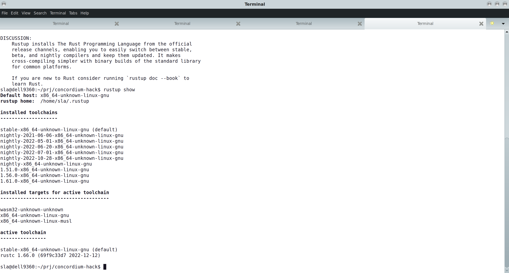
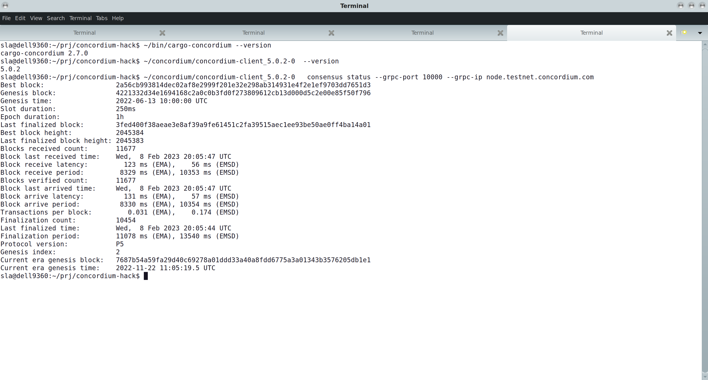
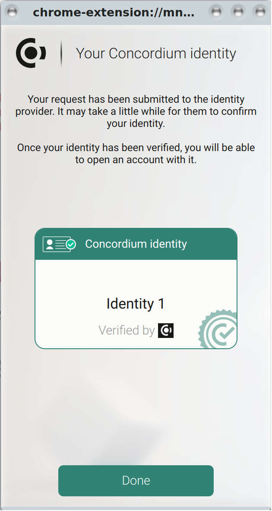
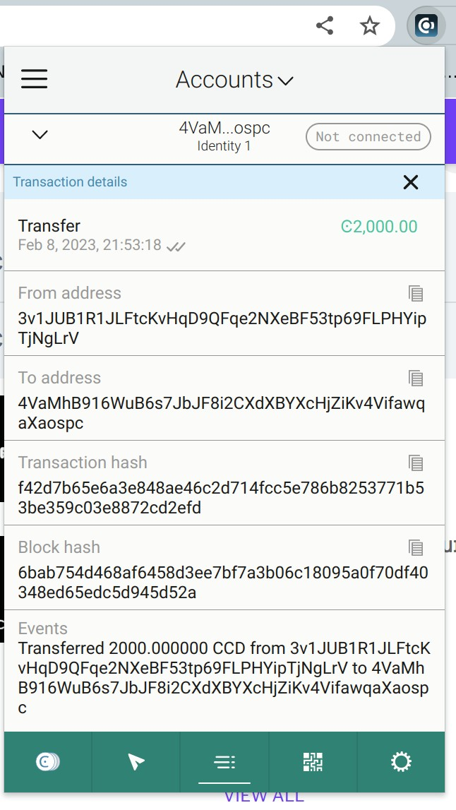
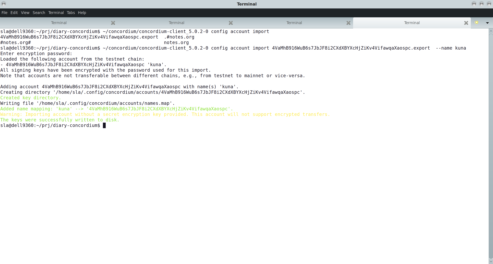

# CONCORDIUM HACKATON - TASK 1 - SUBMISSION

Mainnet address: to be specified later (compliance check cannot recognise my ID.)

## Rust

## `concordium-client`

## wallet

## faucet

## importing private key

