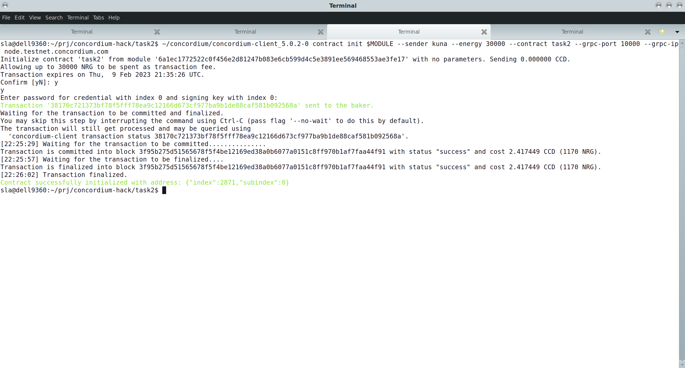

# CONCORDIUM HACKATON - TASKS 1 and 2- SUBMISSION

Mainnet address: to be specified later (compliance check cannot recognise my ID.)

## TASK 1

### Rust

### `concordium-client`

### wallet

### faucet

### importing private key


## TASK 2


### compile


### test and simulate
```
 cargo concordium build -e --out ./task2.wasm.v1
 
 cargo concordium run init --module ./task2.wasm.v1 --contract task2 --context contextInit.json --out-bin state.bin
 
 cargo concordium run update --entrypoint view --module ./task2.wasm.v1 --state-bin state.bin --contract task2 --context contextUpdate.json
 
 cargo concordium run update --entrypoint receive --module ./task2.wasm.v1 --state-bin state.bin --out-bin state2.bin --contract task2 --context contextUpdate.json
 
 cargo concordium run update --entrypoint view --module ./task2.wasm.v1 --state-bin state2.bin --contract task2 --context contextUpdate.json

```

### init



### test


## TASK 3

This is the simplest DAP possible - jsut calls the contract from the Task2 from the browser.

[Screencast](https://youtu.be/KvF_oRn2uiM)

Instructions:
1 `cd task3` 
2 `npm start`
3 go to browser and click - see the screencast

### Transaction IDs
 * Deploy Transaction '15048898c099e85a3158748e3e16db7ce3119798cc60b67e457ffddb666ba93b'
 * Init Transaction '38170c721373bf78f5fff78ea9c12166d673cf977ba9b1de88caf581b092568a'
 * Update Transaction '486fd73bddfbb59bc6e2e56f43f6c6b729bece4bc3ff34a9a1790a716f676f01' 

(no parameters)
s